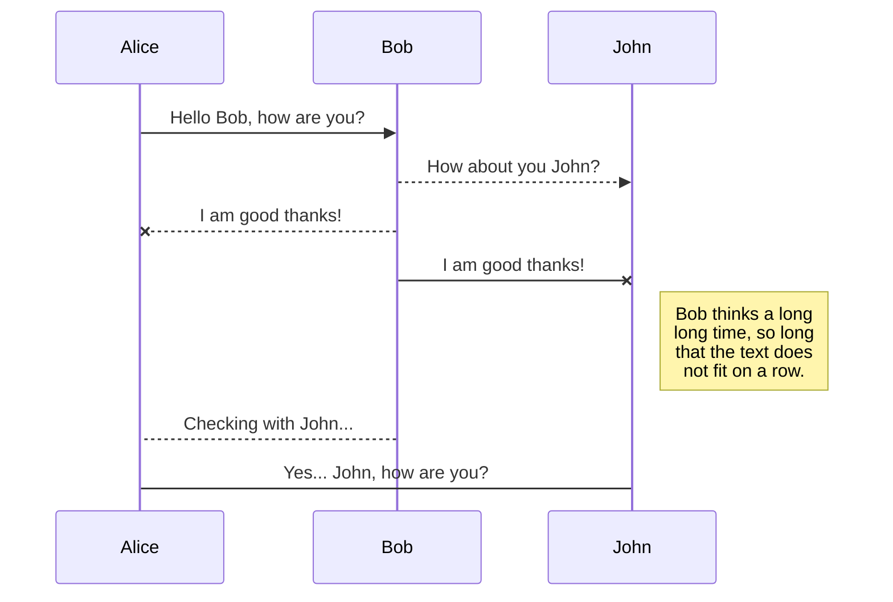
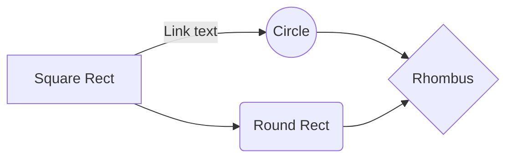

# Mastermind
#### A terminal based game.
This is documentation is a guide on how to install and use the application. The following topics are covered:

- Installation
- Technologies used
- Challenge Requirements
- Attempted extra features.

## Installation
This application is built with Java 11 and MySQL server Version 8. A part of the applicaiton includes JUnit testing farmework to test the curial or the core function of the application. The instruciton provided here is based on the IntelliJ IDEA community edition IDE. Finally, there is a need for an API key (provided for this purpose) for random.org's API to access their random generator API. The two JAR files one for MySQL dependency and another for API is also provided with needs to be added into the module before being able to use the application.

- To Download Java 11, please referen to this link https://www.oracle.com/java/technologies/javase/jdk11-archive-downloads.html
- To install Java 11, please refer to this link https://docs.oracle.com/en/java/javase/11/install/
- To install MySQL Server community edition, please follow the following link https://dev.mysql.com/downloads/mysql/
- For help on how to use MySQL, click on the following link https://dev.mysql.com/doc/
- This link shows how to add a dependce/jar file into a java project in IntelliJ https://stackoverflow.com/questions/30651830/use-jdbc-mysql-connector-in-intellij-idea
- For insturction on how to use the random.org API, please visit this https://github.com/iarks/random_org-api-example
- Note: you don't need mysql server, if ou prefer to read and write guess history in the RAM. MySQL is used for presistance purposes.
- To download the jar files, please visit the github link -> https://github.com/menhaj007/jarsFiles

## Core requirements of this proejct is list below.
### Prepareing the System for the project.
1. To make sure you have Java 11 installed, type in the terminal
```
$: java -version
=>: Similiar Output:
v openjdk version "11.0.11" 2021-04-20
=>: openJDK runtime Environment OS..
=>: openJDK 64bit Server VM..
```
2. Please make sure you have Intellija Idea installed. You can also downloaded here ->
   -- https://www.jetbrains.com/idea/
3. Random API generator.
   --  You can create your own API, or can you the temporary one available inside the project.
   -- Download the Random Generator jar dependency, and review the insation provided on the link here ->
   https://github.com/menhaj007/jarsFiles

This meets all of the requirents to test the core feature of the application such as logic, feedback, history and output. However, if you do want to use it at this level, please comment out all methods in Mastermind.java where it marked as DBMethod.
If you want to test with MySQL and JUNIT, the following steps are required.

4. install MySQL Database from the above links. Once install either using workbench or command line, issue the following commands to create database and make it active:
   -- change the path location for jdbc so it matches your computer's information.
```
public static void readFeedbackFromDB() {
        try {
            Connection connection = DriverManager.getConnection("jdbc:mysql://localhost:3306/mastermind", "your_user_name", "your_mysql's_user_password");
            Statement statement = connection.createStatement();
            ResultSet resultSet = statement.executeQuery("SELECT * FROM computer_feedback");
            while (resultSet.next()) {
                String userData = resultSet.getString("id") +  "\t" + resultSet.getString("userName") + "\t" + resultSet.getString("correctNumberLocation") + "\t" + resultSet.getString("correctNumberOnly") + "\t" + resultSet.getString("incorrectGuess")+ "." ;
                System.out.println(userData);
            }
            connection.close();
        } catch (Exception e) {
            e.printStackTrace();
        }
    }
```
- Visit this link for more information:
  -- https://zetcode.com/db/mysqljava/#:~:text=To%20connect%20to%20MySQL%20in%20Java%2C%20MySQL%20provides,does%20not%20rely%20on%20the%20MySQL%20client%20libraries.
```
CREATE database mastermind; 
use mastermind;
```
5. create tables;
```
CREATE TABLE computer_feedback(
    id INT PRIMARY KEY NOT NULL AUTO_INCREMENT,
    userName VARCHAR(30) NULL,
    correctNumberLocation INT NULL,
    correctNumberOnly INT NULL,
    incorrectGuess INT NULL
);
CREATE TABLE user_input_history(
    id INT PRIMARY KEY NOT NULL AUTO_INCREMENT,
    userName VARCHAR(30) NULL,
    userInput VARCHAR(250) NULL
);

CREATE TABLE user_name_feedback_guess(
    id INT PRIMARY KEY NOT NULL AUTO_INCREMENT,
    userName VARCHAR(30) NULL,
    feedback VARCHAR(250) NULL,
    guess VARCHAR(250) NULL
);
```
Use the following commands to delte a table, check the structure of the table.
```
show tables;
desc table_name;
drop table table_name;

Select * from table_name;
SELECT * FROM user_input_history;
```
6. Make sure that MySQL depency is added to your project. Please refer to the following link to download and install the dependency. Installing MySQL dependency jar file is similar to Random Generator Dependency.
```
https://github.com/menhaj007/jarsFiles
```

Now, your IDE should be able to run the application. For more information about using mysql with Java, please visit the following link.
-- https://zetcode.com/db/mysqljava/#:~:text=To%20connect%20to%20MySQL%20in%20Java%2C%20MySQL%20provides,does%20not%20rely%20on%20the%20MySQL%20client%20libraries.
7. Unit is import into the project but haven't been used in its full effect. There are links provided, if you want to use a JUnit library. Version 4 and 5 will work.
- https://it-qa.com/how-do-i-get-junit-5-in-intellij/
- https://www.jetbrains.com/help/idea/junit.html

## Technology
Familiarity with the following technologies can help.
- Java, C++
- SQL, PL/SQL, T-SQL
- GitHub, for access repository
- MySQL Workbench, MySQL terminal App.
## Dependencies
Instructions on how to use them in your own application are linked below.

| Dependency | README |
| ------ | ------ |
| MySQL DBC Driver  |[https://github.com/menhaj007/jarsFiles/blob/main/mysql-connector-java-8.0.27.jar] |
| Random.org API | [https://github.com/menhaj007/jarsFiles/blob/main/mysql-connector-java-8.0.27.jar] |
| JUNIT | [https://github.com/menhaj007/jarsFiles/blob/main/org_junit_platform_junit-platform-console-standalone_1.6.0_junit-platform-console-standalone-1.6.0.jar] |
## Link for JavaDoc
- https://github.com/menhaj007/reach_mastermind/tree/main/src/JavaDocsReadMe
## Design of the app

## Variables and Methods in the application
#### There is a javadoc comments available inside the application, please feel free to review the code with the comments on the same page or review these bullet points.
The following variables are used at global scope.
- [computerPoints], initialized with 10. On Each correct guess, these points are deducted
- [userPoints], initialized with the value of 10. On each wrong guess, user loses points.
- [-difficultyLevelValue], There are 3 levels in this game. If user enters 1, the value of this variable changes to 4. Which means, the random number will consist of an array integer with length 4. If user's choice 2, the array length will be 6, and 3 will consist of 8 elements. The user's input also reduce the maximum number of tries to from 10, 8, 5 respectively.
- [numberOfAttemps], the default value is 10. But it will change when user chooses a difficult level and if user keep guessing the number. It will reset when user agrees to play again.
- [computerFeedback], type String, this is a 2 Dimension array. A player's feedback is copied here to the player can review either after failling the game or winning the game. This method doesn't automatically push the data to MySQL. It is just in memory access data.
- [guessHistory], type String, will hold the information about the users guesses only to keep the record cleaner for review.
- [numberOfSavedFeedback]
- [numberSavedHistory]
- The last two variables are used to keep track of the saved results and feedbacks to avoid unncessary loops for null values.
- [userName], This will record a player's name on the initial start and will be saved with each player's game cycle.
- [isWin], keep status of the while loop to avoid unnecessary loops. It is declared at global scope to provide flexibilty for the other methods.

The following Methods are designed to either communit with the user or serve as a helper method.

- chooseDifficultyLevel(), asks the user for an integer input, then changes the numberOfRandomNumber, max, min limit for the random.org/api generator.
- generateRandomNumbers(), makes a get request to random.org/api to generate a random array of integers. Then it return the array for future use.
- isValid(String userGuess), will accept a userValue, then checks if the input has numberic values between 0 and 9, and also check if the userInput value's length is equal to difficulty level. if userInput is size 4, then the random array length must 4 too. Otherwise, it fails. It returns truthy/falsy.
- convertStringToArrayOfInteger(), accepts a string, in this case user's input, then converts the charcters to integer, so it can be compared.
- readUserInput(), in the terminal, it asks for the user to enter values.
- start(), this function job is to record user's name at global scoope. Then starts the game.
- play(), the engine for this application. This method/function triggers other functions such as chooseDifficultyLevel(), generateRandomNumbers(), wile loop, and calculate. ...
- calculate(), this method takes two arrays, then compares them to determin if their values match. For instance, arrayA = {1,2,3,1}, arrayB = {1,2,3,4}. There will be thee correct number on the correct location, One value 4, is incorrect because is not in the list. Since arrayA has two 1s, the exact location takes precedence over the wrong location. If arrayA = {1,2,4,3}, an arrayB = {2,1,3,4}, this will produce 4 correct numbers in the in the wrong positions. There is JUnit test written for this method, you can run your test. The difficult part in this challenge was to find the result for (true, false, false), if all matched, other two conditions will fail, if the second matched the first and last will fail, if the was true, the first two would fail. Perhaps, there many ways to solve this, but I ended up using multiple arrays then comparing the index values in both. if a match found, then replaced with a value out of the domain range in this case {x>=0}, since negative values are not not part of the domain, I keep replacing the tmpArray to keep testing. The Otherway, I thought to work on it was to use a string, if a number found the first match in the list, then increment the counter, if not, added to the string, so at the end, the string will cosist of not matched? true: false,
- guessedCorrectAndNumberLocation, it increments when two values at exact indices match in the two arrays.
- guessedCorrectNumber, it increments when a value doesn't have an exact position match but still exist in the list. It is only match with one value, if there are two {1,1}, {1,2}, only the first correct match increments.
-
- incorrectGuess, after find the correct and incorrectValueAtWrongPost, then add them then subtract from the array.length;
- writeFeedbackIntoDB, this method takes an object with the result of numbers and saves in the database.
- saveFeedback(), saves the feedback in the RAM.
- -getFeedback() reads from RAM. If the program stop, it loses all of its data.
- result(), just prints you won!
- saveGuessHistory(String guessed), save entered values into RAM
- getGuessHistory prints them.
-
The following parts are manual. It is user's choice to install with the application or not. This app can work with mysql. To work without MySQL connection delete all methods with "DB" letters in their signature methods.
- writeInputHistoryINtoDB(String userName, String guess), write the user input with its in the database for future access.
- I was tempted to use one -> many relationship. A user can have many guesses, but due to the time constraints, I left it behind.
- There is no relationship model in this app. It just saves data and if need can delete them too.
- hint(int[] array), if a user guess 3 times, and still can find the number, it gives them a range of the minimum value and the maximum value in the array.
- resetHistory(), it sets all variables to initial state. If a player wants to play again, then this methods wipes out the told numberOfAttempts, history and feedback to start new.

## Conclusion
There couple lessons that learned by doing this coding challenge. Since this was my first one, I spent sometimes on deciding what I should use. Will just a web-page with css, html, and JavaScript suffice, will Nodejs + MySQL + React will be a good choice? I started doing some of each, then revisited my notes and saw that the recruiter had emphasized to use a technology based on the job you applied. At that memoment, I realized that I wasted sometime. Immediately, started planing on Java. The first thing I thought was to build a spring-boot api, but I noticed that a player can't interact directly without the api without prior knowldge of postman, insome and etc. At end decided a CLI app should be enough. Once the application was built, then wondered should I save the history into a file or a database, and finally decided to use MySQL because it runs on MacOS, Windows and Linux. This chanlleged thoght me that best way to learn is to build. I had nevere tried to access mysql from a just a plain java application without a middleware and a server.

# Welcome to Mastermind!

Hi! I'm your first Markdown file in **StackEdit**. If you want to learn about StackEdit, you can read me. If you want to play with Markdown, you can edit me. Once you have finished with me, you can create new files by opening the **file explorer** on the left corner of the navigation bar.


# Files

StackEdit stores your files in your browser, which means all your files are automatically saved locally and are accessible **offline!**

## Create files and folders

The file explorer is accessible using the button in left corner of the navigation bar. You can create a new file by clicking the **New file** button in the file explorer. You can also create folders by clicking the **New folder** button.

## Switch to another file

All your files and folders are presented as a tree in the file explorer. You can switch from one to another by clicking a file in the tree.

## Rename a file

You can rename the current file by clicking the file name in the navigation bar or by clicking the **Rename** button in the file explorer.

## Delete a file

You can delete the current file by clicking the **Remove** button in the file explorer. The file will be moved into the **Trash** folder and automatically deleted after 7 days of inactivity.

## Export a file

You can export the current file by clicking **Export to disk** in the menu. You can choose to export the file as plain Markdown, as HTML using a Handlebars template or as a PDF.


# Synchronization

Synchronization is one of the biggest features of StackEdit. It enables you to synchronize any file in your workspace with other files stored in your **Google Drive**, your **Dropbox** and your **GitHub** accounts. This allows you to keep writing on other devices, collaborate with people you share the file with, integrate easily into your workflow... The synchronization mechanism takes place every minute in the background, downloading, merging, and uploading file modifications.

There are two types of synchronization and they can complement each other:

- The workspace synchronization will sync all your files, folders and settings automatically. This will allow you to fetch your workspace on any other device.
  > To start syncing your workspace, just sign in with Google in the menu.

- The file synchronization will keep one file of the workspace synced with one or multiple files in **Google Drive**, **Dropbox** or **GitHub**.
  > Before starting to sync files, you must link an account in the **Synchronize** sub-menu.

## Open a file

You can open a file from **Google Drive**, **Dropbox** or **GitHub** by opening the **Synchronize** sub-menu and clicking **Open from**. Once opened in the workspace, any modification in the file will be automatically synced.

## Save a file

You can save any file of the workspace to **Google Drive**, **Dropbox** or **GitHub** by opening the **Synchronize** sub-menu and clicking **Save on**. Even if a file in the workspace is already synced, you can save it to another location. StackEdit can sync one file with multiple locations and accounts.

## Synchronize a file

Once your file is linked to a synchronized location, StackEdit will periodically synchronize it by downloading/uploading any modification. A merge will be performed if necessary and conflicts will be resolved.

If you just have modified your file and you want to force syncing, click the **Synchronize now** button in the navigation bar.

> **Note:** The **Synchronize now** button is disabled if you have no file to synchronize.

## Manage file synchronization

Since one file can be synced with multiple locations, you can list and manage synchronized locations by clicking **File synchronization** in the **Synchronize** sub-menu. This allows you to list and remove synchronized locations that are linked to your file.


# Publication

Publishing in StackEdit makes it simple for you to publish online your files. Once you're happy with a file, you can publish it to different hosting platforms like **Blogger**, **Dropbox**, **Gist**, **GitHub**, **Google Drive**, **WordPress** and **Zendesk**. With [Handlebars templates](http://handlebarsjs.com/), you have full control over what you export.

> Before starting to publish, you must link an account in the **Publish** sub-menu.

## Publish a File

You can publish your file by opening the **Publish** sub-menu and by clicking **Publish to**. For some locations, you can choose between the following formats:

- Markdown: publish the Markdown text on a website that can interpret it (**GitHub** for instance),
- HTML: publish the file converted to HTML via a Handlebars template (on a blog for example).

## Update a publication

After publishing, StackEdit keeps your file linked to that publication which makes it easy for you to re-publish it. Once you have modified your file and you want to update your publication, click on the **Publish now** button in the navigation bar.

> **Note:** The **Publish now** button is disabled if your file has not been published yet.

## Manage file publication

Since one file can be published to multiple locations, you can list and manage publish locations by clicking **File publication** in the **Publish** sub-menu. This allows you to list and remove publication locations that are linked to your file.


# Markdown extensions

StackEdit extends the standard Markdown syntax by adding extra **Markdown extensions**, providing you with some nice features.

> **ProTip:** You can disable any **Markdown extension** in the **File properties** dialog.


## SmartyPants

SmartyPants converts ASCII punctuation characters into "smart" typographic punctuation HTML entities. For example:

|                |ASCII                          |HTML                         |
|----------------|-------------------------------|-----------------------------|
|Single backticks|`'Isn't this fun?'`            |'Isn't this fun?'            |
|Quotes          |`"Isn't this fun?"`            |"Isn't this fun?"            |
|Dashes          |`-- is en-dash, --- is em-dash`|-- is en-dash, --- is em-dash|


## KaTeX

You can render LaTeX mathematical expressions using [KaTeX](https://khan.github.io/KaTeX/):

The *Gamma function* satisfying $\Gamma(n) = (n-1)!\quad\forall n\in\mathbb N$ is via the Euler integral

$$
\Gamma(z) = \int_0^\infty t^{z-1}e^{-t}dt\,.
$$

> You can find more information about **LaTeX** mathematical expressions [here](http://meta.math.stackexchange.com/questions/5020/mathjax-basic-tutorial-and-quick-reference).


## UML diagrams

You can render UML diagrams using [Mermaid](https://mermaidjs.github.io/). For example, this will produce a sequence diagram:



And this will produce a flow chart:

